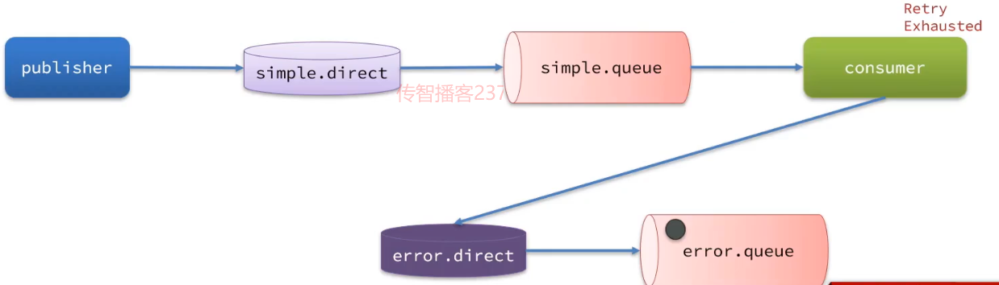

## 1. 消息可靠性

### 常见的丢失原因包括：

- 发送时丢失：
  - 生产者发送的消息未送达exchange
  - 消息到达exchange后未到达queue
- MQ宕机，queue将消息丢失
- consumer接收到消息后未消费就宕机


### 解决方案：

- 开启生产者确认机制, 确保生产者的消息能到达队列
- 开启持久化功能, 确保消息未消费前在队列中不会丢失
- 开启消费者确认机制为auto, 由spring确认消息处理成功后完成ack
- 开启消费者失败重试机制, 并设置MessageRecoverer, 多次重试失败后将消息投递到异常交换机, 交友人工处理


#### 1.1 生产者消息确认

RabbitMQ提供了publisher confirm机制来避免消息发送到MQ过程中丢失。这种机制必须给每个消息指定一个唯一ID。消息发送到MQ以后，会返回一个结果给发送者，表示消息是否处理成功。

返回结果有两种方式：

- publisher-confirm，发送者确认
  - 消息成功投递到交换机，返回ack
  - 消息未投递到交换机，返回nack
- publisher-return，发送者回执
  - 消息投递到交换机了，但是没有路由到队列。返回ACK，及路由失败原因。

**注意：确认机制发送消息时, 需要给每个消息设置一个全局唯一id, 以区分不同消息, 避免ack冲突**


1. 修改publisher服务中的application.yml文件，添加下面的内容：

```yml
spring:
  rabbitmq:
    publisher-confirm-type: correlated	#异步回调，定义ConfirmCallback，MQ返回结果时会回调这个ConfirmCallback
    publisher-returns: true	# 开启publish-return功能，同样是基于callback机制，不过是定义ReturnCallback
    template:
      mandatory: true	# 定义消息路由失败时的策略。true，则调用ReturnCallback；false：则直接丢弃消息
```

说明：

- `publish-confirm-type`：开启publisher-confirm，这里支持两种类型：
  - `simple`：同步等待confirm结果，直到超时(性能低)
  - `correlated`：异步回调，定义ConfirmCallback，MQ返回结果时会回调这个ConfirmCallback
- `publish-returns`：开启publish-return功能，同样是基于callback机制，不过是定义ReturnCallback
- `template.mandatory`：定义消息路由失败时的策略。true，则调用ReturnCallback；false：则直接丢弃消息


2. 定义Return回调

每个RabbitTemplate只能配置一个ReturnCallback，因此需要在项目加载时配置：

修改publisher服务，添加一个：(此配置是用于保证交换机的可靠)

```java
package cn.itcast.mq.config;

import lombok.extern.slf4j.Slf4j;
import org.springframework.amqp.rabbit.core.RabbitTemplate;
import org.springframework.beans.BeansException;
import org.springframework.context.ApplicationContext;
import org.springframework.context.ApplicationContextAware;
import org.springframework.context.annotation.Configuration;

@Slf4j
@Configuration
public class CommonConfig implements ApplicationContextAware {
    @Override
    public void setApplicationContext(ApplicationContext applicationContext) throws BeansException {
        // 获取RabbitTemplate
        RabbitTemplate rabbitTemplate = applicationContext.getBean(RabbitTemplate.class);
        // 设置ReturnCallback
        rabbitTemplate.setReturnCallback((message, replyCode, replyText, exchange, routingKey) -> {
            // 投递失败，记录日志
            log.info("消息发送失败，应答码{}，原因{}，交换机{}，路由键{},消息{}",
                     replyCode, replyText, exchange, routingKey, message.toString());
            // 如果有业务需要，可以重发消息
        });
    }
}
```

3. 定义ConfirmCallback(此处是为了交换机到队列的可靠)

   ConfirmCallback可以在发送消息时指定，因为每个业务处理confirm成功或失败的逻辑不一定相同。

   ```java
   package cn.itcast.mq.spring;
   
   import lombok.extern.slf4j.Slf4j;
   import org.junit.Test;
   import org.junit.runner.RunWith;
   import org.springframework.amqp.rabbit.connection.CorrelationData;
   import org.springframework.amqp.rabbit.core.RabbitTemplate;
   import org.springframework.beans.factory.annotation.Autowired;
   import org.springframework.boot.test.context.SpringBootTest;
   import org.springframework.test.context.junit4.SpringRunner;
   
   import java.util.UUID;
   
   @Slf4j
   @RunWith(SpringRunner.class)
   @SpringBootTest
   public class SpringAmqpTest {
       @Autowired
       private RabbitTemplate rabbitTemplate;
   
       @Test
       public void testSendMessage2SimpleQueue() throws InterruptedException {
           String routingKey = "simple";
           //准备消息
           String message = "hello, spring amqp!";
           //消息ID
           CorrelationData correlationData = new CorrelationData(UUID.randomUUID().toString());
           //准备ConfirmCallback
           correlationData.getFuture().addCallback(result -> {
               if (result.isAck()) {
                   //ACK
                   log.debug("消息成功投递到交换机! 消息ID: {}",correlationData.getId());
               }else{
                   //NACK
                   log.error("消息投递到交换机失败! 消息ID: {}",correlationData.getId());
                   //消息重发
               }
           },ex -> {
               //记录日志
               log.error("消息发送失败!",ex);
               //重发消息
           });
           rabbitTemplate.convertAndSend("camq.topic", routingKey, message,correlationData);
       }
   }
   ```

   

#### 1.2 消息持久化(spring默认是持久化)

1. 消费者端定义配置类

   ```java
   package cn.itcast.mq.config;
   
   import org.springframework.amqp.core.*;
   import org.springframework.amqp.support.converter.Jackson2JsonMessageConverter;
   import org.springframework.amqp.support.converter.MessageConverter;
   import org.springframework.context.annotation.Bean;
   import org.springframework.context.annotation.Configuration;
   
   @Configuration
   public class CommonConfig {
       @Bean
       public DirectExchange simpleExchange(){
           // 三个参数：交换机名称、是否持久化、当没有queue与其绑定时是否自动删除
           return new DirectExchange("simple.direct", true, false);
       }
   
       @Bean
       public Queue simpleQueue(){
           //队列持久化
           return QueueBuilder.durable("simple.queue").build();
       }
   }
   
   ```

2. 消费者设置消息持久化(test为例, cn.itcast.mq.spring.SpringAmqpTest类)

   ```java
       //消息持久化
       @Test
       public void testDurableMessage(){
           //1. 准备消息
           Message message = MessageBuilder.withBody("hello, spring".getBytes(StandardCharsets.UTF_8))
                   .setDeliveryMode(MessageDeliveryMode.PERSISTENT)    //持久化
                   .build();
           //2. 发送消息
           rabbitTemplate.convertAndSend("simple.queue",message);
       }
   ```

#### 1.3消费者消息确认

1. 修改consumer服务的application.yml文件，添加下面内容：

   ```yml
   spring:
     rabbitmq:
       listener:
         simple:
           acknowledge-mode: auto # 关闭ack
   ```

2. 失败重试机制, 利用spring的retry机制

   修改consumer服务的application.yml文件，添加内容：

   ```yml
   spring:
     rabbitmq:
       listener:
         simple:
           retry:
             enabled: true # 开启消费者失败重试
             initial-interval: 1000 # 初识的失败等待时长为1秒
             multiplier: 1 # 失败的等待时长倍数，下次等待时长 = multiplier * last-interval
             max-attempts: 3 # 最大重试次数
             stateless: true # true无状态；false有状态。如果业务中包含事务，这里改为false
   ```

   重启consumer服务，重复之前的测试。可以发现：

   - 在重试3次后，SpringAMQP会抛出异常AmqpRejectAndDontRequeueException，说明本地重试触发了
   - 查看RabbitMQ控制台，发现消息被删除了，说明最后SpringAMQP返回的是ack，mq删除消息了

   

   结论：

   - 开启本地重试时，消息处理过程中抛出异常，不会requeue到队列，而是在消费者本地重试
   - 重试达到最大次数后，Spring会返回ack，消息会被丢弃

   **测试见listener类**

   

   3. 失败重试机制耗尽过后的处理策略

      - RejectAndDontRequeueRecoverer：重试耗尽后，直接reject，丢弃消息。默认就是这种方式

      - ImmediateRequeueMessageRecoverer：重试耗尽后，返回nack，消息重新入队

      - RepublishMessageRecoverer：重试耗尽后，将失败消息投递到指定的交换机

      

      比较优雅的一种处理方案是RepublishMessageRecoverer，失败后将消息投递到一个指定的，专门存放异常消息的队列，后续由人工集中处理。
      
      
      
      ​	1）在consumer服务中定义处理失败消息的交换机和队列
      
      ```java
      package cn.itcast.mq.config;
      
      import org.springframework.amqp.core.Binding;
      import org.springframework.amqp.core.BindingBuilder;
      import org.springframework.amqp.core.DirectExchange;
      import org.springframework.amqp.core.Queue;
      import org.springframework.context.annotation.Bean;
      import org.springframework.context.annotation.Configuration;
      
      /**
       * @author SaddyFire
       * @date 2022/3/15
       * @TIME:23:23
       */
      @Configuration
      public class ErrorMessageConfig {
          @Bean
          public DirectExchange errorMessageExchange(){
              return new DirectExchange("error.direct");
          }
          @Bean
          public Queue errorQueue(){
              return new Queue("error.queue", true);
          }
          @Bean
          public Binding errorBinding(Queue errorQueue, DirectExchange errorMessageExchange){
              return BindingBuilder.bind(errorQueue).to(errorMessageExchange).with("error");
          }
          //定义一个RepublishMessageRecoverer，关联队列和交换机
          @Bean
          public MessageRecoverer republishMessageRecoverer(RabbitTemplate rabbitTemplate){
              //此处交换机名字一定要和上面的名字相同, 所用的routingKey也要和上方一致
              return new RepublishMessageRecoverer(rabbitTemplate, "error.direct", "error");
          }
      }
      ```

## 2. 消息堆积问题

- 增加更多消费者，提高消费速度。也就是我们之前说的work queue模式

- 在消费者内开启线程池加快消息处理速度

- 扩大队列容积，提高堆积上限(惰性队列)

  消费者定义配置类config

```java
package cn.itcast.mq.config;

import org.springframework.amqp.core.Queue;
import org.springframework.amqp.core.QueueBuilder;
import org.springframework.context.annotation.Bean;
import org.springframework.context.annotation.Configuration;

/**
 * @author SaddyFire
 * @date 2022/3/15
 * @TIME:23:47
 */
@Configuration
public class LazyConfig {

    @Bean
    public Queue lazyQueue() {
        return QueueBuilder.durable("lazy.queue")
                .lazy()
                .build();
    }

    @Bean
    public Queue normalQueue(){
        return QueueBuilder.durable("normal.queue")
                .build();
    }
}

```

